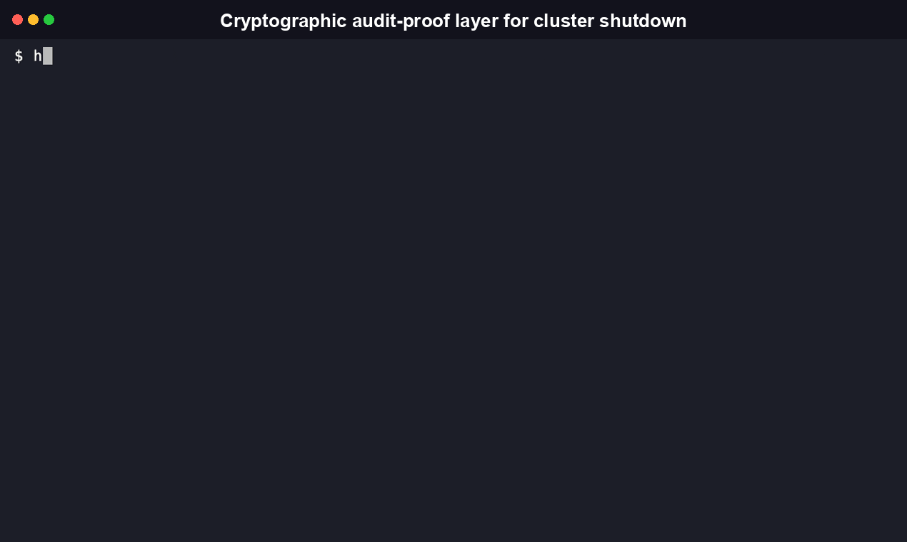
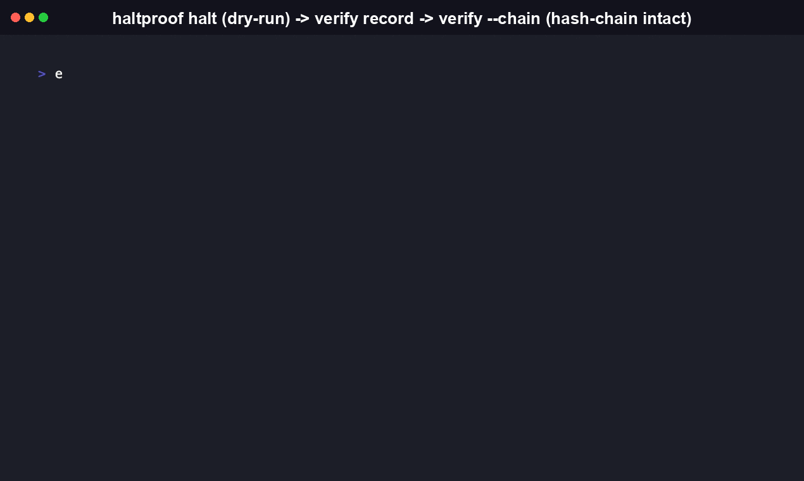
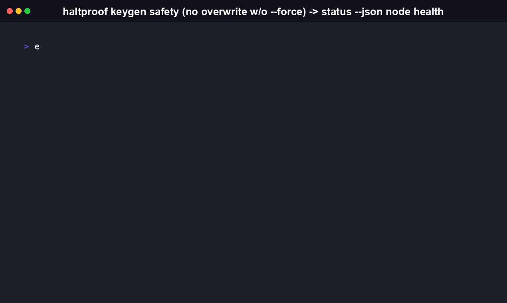

<!-- mcp-name: io.github.RudrenduPaul/haltproof -->

# HaltProof

Emergency-shutdown orchestration for Slurm, Kubernetes, and IPMI clusters, with an Ed25519-signed, hash-chained attestation record of exactly what ran.

[](https://github.com/RudrenduPaul/HaltProof/actions/workflows/ci.yml)
[](https://pypi.org/project/haltproof-cli/)
[](https://www.npmjs.com/package/haltproof-cli)
[](LICENSE)

**Signed, dry-run-by-default shutdown orchestration for Slurm, Kubernetes,
and IPMI clusters, with a tamper-evident audit trail.**



HaltProof is an emergency-shutdown **orchestration** and **cryptographic
audit-proof** layer for compute clusters. It does not implement a new
low-level shutdown mechanism. It coordinates cluster primitives you already
trust (Slurm, Kubernetes, IPMI/BMC) and produces a signed, tamper-evident
record of exactly what was targeted, what ran, and who authorized it.

```bash
pip install haltproof-cli
```

(Full install options, including the npm wrapper, are in
[Install](#install) below.)

## Why

Operators already have the tools to drain a Slurm partition, cordon a
Kubernetes node pool, or power-fence a physical host over IPMI. What's
usually missing is:

1. **One consistent interface** across those tools during an incident,
   instead of three different command sets under pressure.
2. **A dry-run-by-default safety rail**, so a mistyped target group doesn't
   take down the wrong nodes.
3. **A signed, tamper-evident record** of what happened: who ran it, what
   commands were issued, against which nodes, whether each step succeeded,
   and whether the record itself has been altered or has a piece missing.

HaltProof is that layer. It calls out to `scontrol`, `kubectl`, and
`ipmitool` (or `mcp`-invokable equivalents) and wraps every invocation in an
Ed25519-signed, hash-chained attestation.

## Install

```bash
pip install haltproof-cli
```

An npm wrapper is also published for Node.js-based tooling and agent runtimes:

```bash
npm install -g haltproof-cli
```

> [!WARNING]
> The npm package requires the Python `haltproof-cli` package to already be
> installed and on `PATH`. It is a thin `execFileSync` wrapper, not a
> reimplementation. If it can't find the Python CLI, it prints an actionable
> error and exits non-zero rather than silently doing something else.

## Table of Contents

- [Features](#features)
- [Quickstart](#quickstart)
- [Commands](#commands)
- [Architecture](#architecture)
- [Security model](#security-model)
- [MCP server (for AI agents)](#mcp-server-for-ai-agents)
- [Comparison](#comparison)
- [What Is HaltProof, and Why Does It Exist](#what-is-haltproof-and-why-does-it-exist)
- [FAQ](#faq)
- [Contributing](#contributing)
- [License](#license)

## Features

- **Dry-run required by default.** `haltproof halt` prints exactly which commands it would run, against which nodes, and still writes a signed attestation of that plan, unless you pass `--confirm`. The gate lives at a single chokepoint (`haltproof.backends.runner.run_step`) that all three backends route through, so it can't be quietly bypassed by one backend's code path.
- **One interface across three real backends.** `kubernetes` (via `kubectl`), `slurm` (via `scontrol`), and `ipmi` (via `ipmitool`) each implement the same four-operation `ClusterBackend` interface: `drain`, `isolate_network`, `power_fence`, `status`. A backend that doesn't support an operation, for example Kubernetes has no physical power-fencing primitive, returns a `SKIPPED` result with an explanation instead of raising, so a halt across a mixed environment still produces one complete attestation.
- **Ed25519-signed, hash-chained attestations.** Every halt, dry-run or executed, appends one signed record to a local append-only NDJSON log. Each record embeds `prev_hash`, the content hash of the record before it, so `haltproof verify --chain` can catch a deleted or reordered entry that a single record's own signature check would miss.
- **Structured output on every command.** `--json` (or `--format json`) is available on `halt`, `verify`, `status`, and `keygen`, so a script or an agent can parse the result without screen-scraping human-formatted text.
- **A real MCP server, built for agents.** `haltproof mcp-server` exposes `halt`, `verify`, `verify_chain`, `status`, and `keygen` as MCP tools over stdio, built on the official `mcp` Python SDK. It calls the same `haltproof.core` functions the CLI calls, so an agent invoking the MCP tool gets the identical dry-run-by-default behavior a human gets from the CLI.
- **Tested.** 76 tests, 90% overall line coverage, run and confirmed in this audit with `pytest -v --cov=haltproof --cov-report=term-missing`. Backend tests mock `subprocess` calls; none of them require a real cluster.

## Quickstart

> [!IMPORTANT]
> `haltproof halt` is a no-op without `--confirm`. It prints the plan and
> writes a signed dry-run attestation, but nothing destructive runs until
> you pass `--confirm` explicitly.

```bash
# Generate a signing key for attestations (do this once).
haltproof keygen --output ~/.config/haltproof/ed25519_key

# See what backend HaltProof auto-detected on this host.
haltproof status

# Dry-run a halt against an explicit node list. Nothing runs yet.
haltproof halt gpu-pod-a --nodes node-1,node-2

# Same halt, actually executed.
haltproof halt gpu-pod-a --nodes node-1,node-2 --confirm

# Verify a past attestation's signature and print its timeline.
haltproof verify 1

# Verify the entire attestation log's hash chain instead of a single
# record: this catches a deleted or reordered entry that a
# single-record signature check alone would miss.
haltproof verify --chain --attestation-log ~/.local/share/haltproof/attestations.jsonl
```

Every command also supports `--json` for agent-parseable output:

```bash
haltproof status --json
haltproof halt gpu-pod-a --nodes node-1 --json
```

### Config file (optional)

Target groups, the preferred backend, and default paths can live in a `haltproof.toml` file (checked in the current directory, then `~/.config/haltproof/config.toml`, or at a path given by `--config` / `HALTPROOF_CONFIG`):

```toml
backend = "kubernetes"
operator_id = "ops-team"
attestation_log_path = "/var/log/haltproof/attestations.jsonl"

[groups]
gpu-pod-a = ["node-1", "node-2", "node-3"]

[kubernetes]
namespace = "training"

[ipmi]
user = "admin"
```

Every config value has a matching CLI flag, and an explicit flag always wins over the config file.

## Commands

Reference below is regenerated from the CLI's actual `--help` output.

### `haltproof halt TARGET_GROUP`

Drain, isolate, and power-fence `TARGET_GROUP`. Dry-run is the default; nothing destructive runs without `--confirm`.



```
Options:
  --nodes TEXT             Comma-separated explicit node list, overrides
                           config group lookup.
  --backend TEXT           Backend to use: kubernetes, slurm, or ipmi.
  --confirm                Actually execute the halt. Without this, dry-run
                           only.
  --reason TEXT            Reason recorded for drain operations.
  --operator-id TEXT       Operator identity to record. Defaults to OS user.
  --config TEXT            Path to a haltproof.toml config file.
  --attestation-log TEXT   Path to the attestation log file.
  --attestation-key TEXT   Path to the Ed25519 private key used to sign the
                           attestation.
  --no-sign                Skip signing (not recommended); still logs the
                           record unsigned.
  --remote-collector TEXT  Optional URL to POST the signed attestation to.
  --format [human|json]    Output format.
  --json                   Shorthand for --format=json.
```

### `haltproof verify [ATTESTATION_REF]`

Verify one attestation record's signature, or an entire log's hash chain. `ATTESTATION_REF` is a path to a record file, or an attestation id / sequence number to look up in the log. Pass `--chain` instead of `ATTESTATION_REF` to verify a whole `--attestation-log`: every record's signature holds, and none has been deleted or reordered.

| Flag | Description |
|---|---|
| `--attestation-log TEXT` | Log to search when `ATTESTATION_REF` is an id/sequence number, or to verify with `--chain`. |
| `--trusted-key TEXT` | Path to a trusted Ed25519 public key; if given, the record's signing key must match it. |
| `--chain` | Verify the full hash chain of `--attestation-log` instead of a single record. |
| `--format [human\|json]` | Output format. |
| `--json` | Shorthand for `--format=json`. |

### `haltproof status`

Show backend auto-detection results and, optionally, target-group health.

| Flag | Description |
|---|---|
| `--backend TEXT` | Backend to check status for; defaults to the auto-detected/configured backend. |
| `--nodes TEXT` | Comma-separated node list to report health for. |
| `--group TEXT` | Named target group (from config) to report health for. |
| `--config TEXT` | Path to a `haltproof.toml` config file. |
| `--format [human\|json]` | Output format. |
| `--json` | Shorthand for `--format=json`. |

### `haltproof keygen`

Generate an Ed25519 keypair for attestation signing. The private key is written with `0600` permissions and is never printed or logged.



```
Options:
  --output TEXT          Path to write the private key to.
  --force                Overwrite an existing key at the output path.
  --format [human|json]  Output format.
  --json                 Shorthand for --format=json.
```

### `haltproof mcp-server`

Starts the HaltProof MCP server on stdio, exposing `halt`, `verify`, `verify_chain`, `status`, and `keygen` as MCP tools. No flags beyond `--help`.

Every subcommand also accepts `--help` directly for the same reference shown above.

## Architecture

HaltProof has three layers:

1. **Transport layer**: the Click-based CLI (`haltproof.cli`) and the MCP server (`haltproof.mcp_server`). Both are thin wrappers over the same core functions in `haltproof.core`, so a human running the CLI and an agent calling the MCP tool get identical behavior, including the dry-run-by-default gate on `halt`.

2. **Backend layer**: a `ClusterBackend` abstract interface (`haltproof.backends.base`) with four operations:

   ```
   ClusterBackend
   ├── drain(nodes, dry_run, reason)         -> stop new work being scheduled
   ├── isolate_network(nodes, dry_run)       -> cut nodes off from the workload network
   ├── power_fence(nodes, dry_run)           -> hard power off
   └── status(nodes)                         -> current reachability/state
   ```

   Three backends implement it today:

   | Backend | drain | isolate_network | power_fence | Underlying tool |
   |---|---|---|---|---|
   | `kubernetes` | cordon + drain | deny-all NetworkPolicy | not supported (use `ipmi`) | `kubectl` |
   | `slurm` | `scontrol update state=drain` | `state=power_down` (SuspendProgram hook) | not supported (use `ipmi`) | `scontrol` |
   | `ipmi` | not supported (use `slurm`/`kubernetes`) | not supported | `ipmitool chassis power off` | `ipmitool` |

   A backend that doesn't support a given operation returns a `SKIPPED` result with an explanation instead of raising, so a halt sequence against a mixed environment still produces one complete, honest attestation record. Adding support for a new scheduler or fencing tool means adding one backend module and registering it in `haltproof.backends.detect`, not touching the orchestration or attestation layers.

   Backend selection order: an explicit `--backend` flag, then the config file's `backend` key, then auto-detection based on which of `kubectl` / `scontrol` / `ipmitool` is found on `PATH`.

3. **Attestation layer** (`haltproof.attestation`): every halt operation, dry-run or real, produces one signed, hash-chained record and appends it to a local append-only NDJSON log.

## Security model

- **Signing.** Attestation records are signed with Ed25519 (`cryptography` library). The signing public key is embedded in the record itself, so `haltproof verify` can check internal signature validity on its own. Pass `--trusted-key` to additionally require the record be signed by one specific known operator key.
- **Tamper evidence, per record.** Signing covers the entire record, operator, target nodes, every step's command and status, timestamps, and the chain link below, except the signature field itself. Changing any field, including hiding a failed step, invalidates the signature.
- **Tamper evidence, across the log.** A record's own signature only proves that record's content is unaltered; it says nothing about whether an entire record was deleted or reordered. Every record embeds `prev_hash`, the content hash of the record immediately before it, so `haltproof verify --chain` can confirm sequence numbers have no gaps and every link in the chain matches.
- **Key handling.** `haltproof keygen` writes the private key with `0600` permissions and never prints or logs key material, in CLI output, JSON output, or the MCP tool result. Anyone holding the key can sign records that verify as coming from you, so treat it like an SSH private key.
- **BMC credentials.** The IPMI backend reads the BMC password from the `IPMI_PASSWORD` environment variable and passes `ipmitool -E`, so it never appears as a command-line argument, in the process list, or in the attestation record's logged command.
- **Dry-run by default.** `haltproof halt` requires an explicit `--confirm` to execute anything destructive, enforced at one chokepoint (`haltproof.backends.runner.run_step`) that every backend routes through.
- **Operator identity.** Recorded from, in order, an explicit `--operator-id`, an SSH certificate identity if the environment exposes one, or the OS user running the command.

## MCP server (for AI agents)

```bash
haltproof mcp-server
```

Starts an MCP server on stdio exposing `halt`, `verify`, `verify_chain`, `status`, and `keygen` as tools, built on the official `mcp` Python SDK. An agent connected over MCP gets the same dry-run-by-default `halt` behavior and the same JSON-shaped results as the CLI's `--json` mode, because the CLI and the MCP server call the same underlying functions in `haltproof.core`.

## Comparison

HaltProof doesn't compete with Slurm, Kubernetes, or IPMI. It sits on top of the tools operators already use for this job and adds what none of them provide on their own: one interface, one safety gate, and a signed record.

| Capability | HaltProof | `kubectl` (native) | `scontrol` (native) | `ipmitool` (native) |
|---|---|---|---|---|
| Single command across Slurm + Kubernetes + IPMI | Yes | No, Kubernetes only | No, Slurm only | No, IPMI only |
| Consistent dry-run gate before any backend executes | Yes, one `--confirm` flag for all three backends | Partial: `--dry-run=client` validates syntax only, not real cluster mutation | No built-in simulate mode; `state=drain` takes effect immediately | No dry-run concept for power commands |
| Cryptographically signed record of what ran | Yes, Ed25519 | No | No | No |
| Detects a deleted or reordered record in the audit trail | Yes, hash-chained log | No | No | No |
| Structured JSON output for every action | Yes, every command | Partial: `-o json` covers read/get commands, not the `drain`/`cordon` action result | No, plain text only | No, plain text only |
| MCP server for direct AI agent invocation | Yes | No | No | No |

A GitHub search run for this audit (August 2026) found no existing open-source project combining unified multi-backend cluster orchestration, a dry-run-by-default gate, and a cryptographically signed, hash-chained audit trail. The closest adjacent projects, like AI agent tool-call policy proxies, operate one layer up: they intercept and audit what an AI agent's tool calls are allowed to do, not the infrastructure-level shutdown of the underlying compute itself. See the FAQ below for how HaltProof relates to that category.

## What Is HaltProof, and Why Does It Exist

HaltProof is an orchestration and audit-proof layer over cluster shutdown primitives operators already trust: `scontrol` for Slurm, `kubectl` for Kubernetes, `ipmitool` for IPMI/BMC. It does not reimplement draining, isolating, or power-fencing a node. It calls the real tool, gates the call behind a dry-run-by-default safety check, and signs a tamper-evident record of exactly what was targeted, what ran, and who authorized it.

It exists because three separate problems tend to show up together during a real incident:

1. **Three different command sets under pressure.** Operators already know how to drain a Slurm partition, cordon a Kubernetes node pool, or power-fence a physical host over IPMI, but doing it consistently across all three during an incident means three different tools, three different flag conventions, and three different failure modes to remember at the worst possible time.
2. **No shared safety rail.** `kubectl drain --dry-run=client` only validates syntax; it doesn't simulate the actual cluster mutation. `scontrol update state=drain` takes effect the moment you run it. A mistyped target group has no consistent, tool-independent way to catch itself before something real happens.
3. **No proof after the fact.** None of the three native tools produce a signed, tamper-evident record of what was targeted, what actually ran, whether it succeeded, and who authorized it. Building that logging and signing layer yourself, for change-management evidence or for a compliance framework like the EU AI Act's human-oversight provisions, means writing it from scratch.

HaltProof is the layer that answers all three at once: one CLI and one MCP surface, one `--confirm` gate that every backend routes through, and one Ed25519-signed, hash-chained attestation log.

## FAQ

**What does HaltProof actually do, and what's its sharpest difference from just scripting `kubectl`/`scontrol`/`ipmitool` directly?**
HaltProof calls the same tools you'd call directly, `scontrol`, `kubectl`, `ipmitool`, but wraps every call in a dry-run-by-default gate and produces an Ed25519-signed, hash-chained attestation record. A hand-rolled script can call the same underlying commands, but it doesn't refuse to execute without `--confirm` and doesn't produce a record that proves, after the fact, that nothing was altered or deleted from the log.

**Does HaltProof actually cut power or network access itself?**
No. It calls `scontrol`, `kubectl`, and `ipmitool`, tools you already run and trust, and wraps each invocation in a dry-run gate and a signed record. HaltProof adds orchestration and proof, not a new low-level shutdown mechanism.

**Which operating systems and Python versions does HaltProof support?**
The published PyPI package targets Python 3.10 and up, on Linux and macOS (see its `Operating System :: POSIX :: Linux` and `Operating System :: MacOS` classifiers). There's no Windows classifier yet, and the IPMI backend in particular depends on shelling out to `ipmitool`, which isn't the primary target on Windows. If you need it there, open an issue.

**How is this different from writing a runbook or an Ansible playbook that calls the same tools?**
A runbook or an Ansible playbook can call the same underlying commands, but it doesn't produce a cryptographically signed, tamper-evident record of what actually ran on its own; you'd need to build that logging and signing layer yourself. HaltProof ships that as the default behavior, and it also gives you a single dry-run-by-default gate across all three backends instead of three separate playbooks with three separate safety conventions.

**Is this an "AI safety kill switch"?**
No. HaltProof is infrastructure incident-response and compliance-audit tooling for cluster operators. It has no opinion on AI model behavior and makes no claims about AI safety or alignment. Tools that intercept and audit an AI agent's individual tool calls operate at a different layer entirely; HaltProof orchestrates the underlying compute shutdown itself, the same way it would for a non-AI workload.

**What happens if a node's underlying tool isn't installed?**
The relevant backend reports that step as `failed` with the actual error, for example `executable not found`, and the attestation record still gets written and signed, so the failure itself becomes part of the auditable history.

**Can I use HaltProof without signing attestations?**
Yes, `--no-sign` skips signing but still writes the record to the log. This is meant for local testing, not production incident response, since an unsigned record can't be verified as authentic.

**Does the attestation log need a central server?**
No. It's a local, append-only NDJSON file by default. `--remote-collector` optionally POSTs each signed record to a URL you configure, for teams that want a central copy, but verification doesn't depend on that server being reachable.

**What happens if two operators run `halt` at the same time against the same attestation log?**
Appends are file-locked (`fcntl.flock` on POSIX) so writes don't interleave, but sequence numbers are assigned by reading the log at the moment each command starts. Point both operators at backend-specific or per-incident log files if you need strict per-operation serialization.

**What license is HaltProof under, and can I use it commercially?**
MIT. You can use, modify, and redistribute it, including commercially, as long as the copyright notice and license text stay attached. See [LICENSE](LICENSE).

## Contributing

Contributions are welcome. Read [CONTRIBUTING.md](CONTRIBUTING.md) first: it covers setting up a dev environment, running the test suite (`pytest -v --cov=haltproof --cov-report=term-missing`), and the steps for adding a new backend by implementing the `ClusterBackend` interface. Changes touching attestation signing/verification or the dry-run/`--confirm` gate get extra review, per [CODEOWNERS](CODEOWNERS). See [SECURITY.md](SECURITY.md) to report a vulnerability privately instead of opening a public issue.

```bash
git clone https://github.com/RudrenduPaul/HaltProof.git
cd HaltProof
python -m venv .venv && source .venv/bin/activate
pip install -e ".[dev]"
pytest -v --cov=haltproof --cov-report=term-missing
```

## License

[MIT](LICENSE) © Rudrendu Paul and Sourav Nandy
